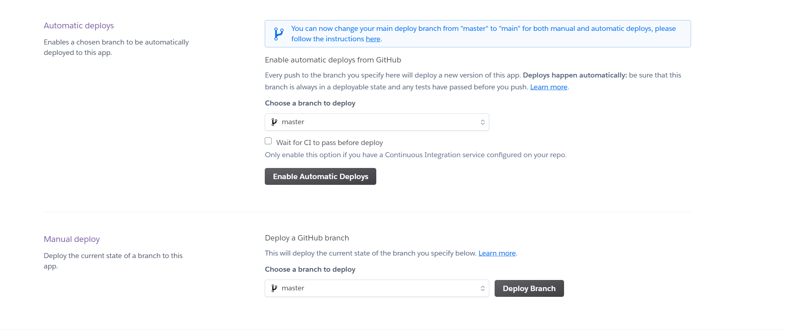

# Mern App Cloud Deployment

### Objectives

- Deploy server and to heroku
- Deploy react app to Heroku

## Disclaimer

This repo is set up assuming that your apps are stuctured the same way we've done them in class.

## Preparing Your Database Connection

Open the `config/config.json` file for sequelize. Rename the file to `config.js`. And refactor it to a module exports like below:

```js
require('dotenv').config()
module.exports = {
  development: {
    database: '<Your Dev Database>',
    dialect: 'postgres'
  },
  test: {
    database: '<Your Database Test Name>',
    dialect: 'postgres'
  },
  production: {
    use_env_variable: 'DATABASE_URL',
    dialect: 'postgres',
    dialectOptions: {
      ssl: {
        rejectUnauthorized: false,
        require: true
      }
    }
  }
}
```

In `models/index.js` we need to fix the require for the config, change the config require statement to the one below:

```js
const config = require(__dirname + '/../config/config.js')[env]
```

## Creating A Heroku Project

Head over to your heroku account and create a new app.

Give your app a name.


Once your app is created select `settings`.

Select `Reveal Config Vars`.

You'll add your environment variables in these fields.

Ex:

- Key:
  `SALT_ROUNDS`

- Value:
  `12`

Under the `Resources` tab, find the `Add-Ons` section and look for `Heroku Postgres` in the search bar. Add the `hobby dev` to your app.

### Wiring Up Our Code

We now need to prep our code for deployment.

In your `server.js`:

- > Require path from `path`:
  >
  > ```js
  > const path = require('path')
  > ```

- > Add the following along side your middleware:
  >
  > ```js
  > app.use(express.static(path.join(__dirname, 'client', 'build')))
  > ```
  >
  > **Note: If you are using `helmet` you **must** make this modification:**
  >
  > ```js
  > app.use(helmet({ contentSecurityPolicy: false }))
  > ```

- > Telling Express to serve our react app:
  >
  > **NOTE**: **This should be added after your middleware**
  >
  > ```js
  > app.get('*', (req, res) =>
  >   res.sendFile(path.join(__dirname, 'client', 'build', 'index.html'))
  > )
  > ```

Finally in your `package.json`, add a new script in your `scripts` section:

```json
    "build": "npx sequelize-cli db:create && npx sequelize-cli db:migrate && npx sequelize-cli db:seed:all  && cd client && rm -rf build && npm install && npm run build""
```

## Pointing Client To Our Api

In `client/src/services/apiclient.js`, modify your `baseURL`:

```js
process.env.NODE_ENV === 'production'
  ? `${window.location.origin}/api`
  : '<your local backend server>/api'
```

## Deploying Our Project

In your `Heroku` account select the deploy tab and select `connect to github`. If prompted to sign in go ahead and do so. You should now have a field to search repos:


Search For your project repo and click on `connect`.

You can now set up automatic deploys:



Select `Enable Automatic Deploy` and make sure it's pointing to your `main` branch.

Now in your project folder, `add`, `commit` and `push` your changes and a build should kick off on heroku!

You can monitor progress in heroku's activity tab!

Once the build is finished you can open your app by using the `Open App` button.
